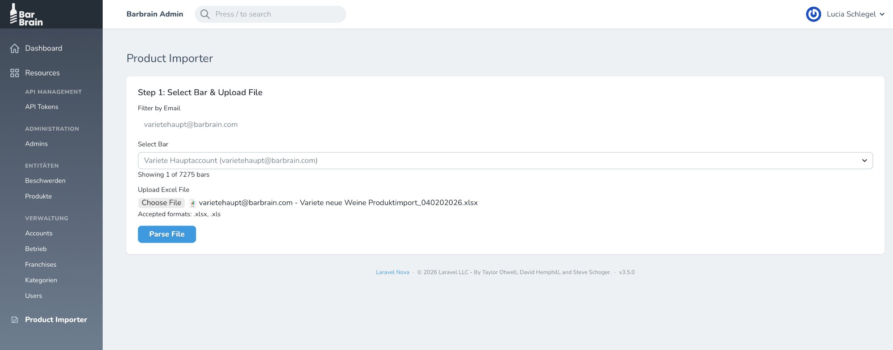
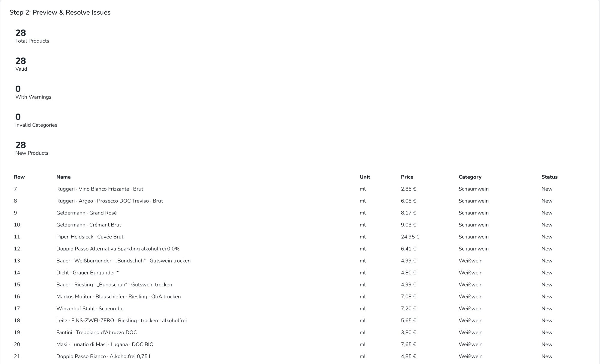
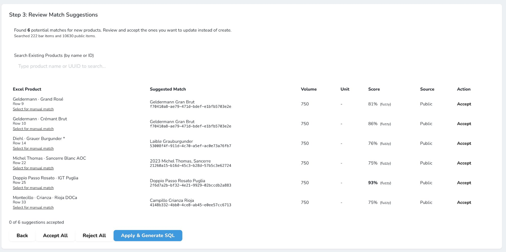

# BarBrain Product Importer

## User Guide

Welcome! The Product Importer tool makes it easy to add new products to your BarBrain inventory using Excel spreadsheets. This guide will walk you through each step of the import process.

The import process has **four simple steps**:

1. Upload your file
2. Preview the data
3. Review any matches with existing products
4. Execute the import

Let's get started!

---

## Step 1: Select Bar & Upload File

This is where you'll select which bar account to import products into and upload your Excel file.

### How to do it

1. **Filter by Email** – Enter your email address to narrow down the list of available bars.

2. **Select Bar** – Use the dropdown menu to choose the specific bar account where you want to import products.

3. **Upload Excel File** – Click Choose File and select your Excel spreadsheet (.xlsx or .xls format).

4. Click the Parse File button to process your spreadsheet.

<strong>💡 Tip:</strong> Make sure your Excel file is in .xlsx or .xls format. Other file types won't be accepted.

---

## Step 2: Preview & Resolve Issues

After parsing your file, you'll see a preview of all the products that will be imported. This is your chance to review everything before proceeding.

### What you'll see

At the top, you'll find a summary showing:

| Metric | Description |
|--------|-------------|
| **Total Products** | The total number of products in your spreadsheet |
| **Valid** | Products that passed all validation checks |
| **With Warnings** | Products that may need attention |
| **Invalid Categories** | Products with unrecognized categories |
| **New Products** | Products that will be created as new entries |

Below the summary, you'll see a table with all your products showing:
- Row number
- Name
- Unit
- Price
- Category
- Status

### Your options

- Back – Return to Step 1 if you need to upload a different file

- Find Existing Matches – Let the system search for similar products that already exist *(recommended!)*

- Generate SQL – Skip matching and go directly to the final step

<strong>💡 Tip:</strong> We recommend clicking "Find Existing Matches" to avoid creating duplicate products in your inventory.

---

## Step 3: Review Match Suggestions

If you clicked "Find Existing Matches," the system will search through your bar's items and the public product database to find products that might already exist. This helps prevent duplicates!

### Understanding the match table

Each row shows a potential match between your Excel product and an existing product:

| Column | Description |
|--------|-------------|
| **Excel Product** | The product name from your spreadsheet |
| **Suggested Match** | The existing product the system thinks might be the same |
| **Volume & Unit** | Product specifications |
| **Score** | How confident the system is about the match (higher % = better match) |
| **Source** | Whether the match is from your bar or the public database |
| **Action** | Click "Accept" to use the existing product instead of creating a new one |

### Your options

- **Accept** *(per row)* – Accept individual matches one at a time

- **Select for manual match** – Search for a different existing product if the suggestion isn't right

- Accept All – Accept all suggested matches at once

- Reject All – Ignore all suggestions and create new products for everything

- Apply & Generate SQL – Proceed with your selections to the final step

<strong>💡 Tip:</strong> Pay attention to the match score – matches above 90% are usually accurate. For lower scores, double-check that it's really the same product!

---

## Step 4: Execute or Download

This is the final step! You'll see a summary of what will be imported and have the choice to execute the import directly or download the SQL for manual review.

### What you'll see

| Metric | Description |
|--------|-------------|
| **Total** | Total number of products being processed |
| **Processed** | Products that will be imported |
| **Skipped** | Products that won't be imported (if any) |

You'll also see a **Generated SQL Preview** showing a preview of the database commands that will run.

### Your options

- Back – Return to the previous step if you need to make changes

- Download SQL – Save the SQL file to your computer (for technical review or backup)

- Execute Import – Run the import now and add all products to your inventory

<strong>⚠️ Important:</strong> Once you click "Execute Import," the products will be added to your bar's inventory immediately. Make sure you've reviewed everything before proceeding!

---

## Quick Reference

Here's a handy summary of the import workflow:

| Step | What to Do | Key Button |
|------|------------|------------|
| **1** | Select bar, upload Excel file | Parse File |
| **2** | Review products, check for issues | Find Existing Matches |
| **3** | Accept or reject suggested matches | Apply & Generate SQL |
| **4** | Review summary, run import | Execute Import |

---

## Troubleshooting

If you run into any issues during the import process, here are some common solutions:

| Problem | Solution |
|---------|----------|
| **File won't upload** | Make sure it's an .xlsx or .xls file |
| **Can't find your bar** | Try filtering by your email address first |
| **Invalid categories showing** | Check that your spreadsheet uses the correct category names |
| **Unsure about a match** | Use "Select for manual match" to search for the correct product yourself |

---

## Need Help?

For additional support, contact your BarBrain administrator.